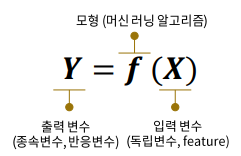

본 포스팅은 '패스트캠퍼스 - 머신러닝과 데이터분석 A-Z 올인원 패키지 Online'을 공부하여 개인적으로 정리 및 기록 목적으로 작성하였습니다.

머신러닝을 공부한 지 꽤 오랜시간이 지났지만, 정리 및 기록하는 습관을 들이기 위함의 차원에서 완전 기초부터 차근차근 작성해보고자 한다.

### Machine learning의 개념

기계 학습 또는 머신러닝은 인공지능의 한 분야로, 컴퓨터가 학습할 수 있도록 하는 알고리즘과 기술을 개발하는 분야를 말한다. (위키피디아)

간단하게 말해서 머신러닝이란  **"무엇(x)으로 무엇(y)를 예측하고 싶다"** 라고 표현할 수 있다. 물론 예측 뿐만 아니라 분류, 인지 등의 다양한 역할을 수행할 수 있다.

- 주어진 데이터를 통해 **입력변수**와 **출력변수** 간 관계를 만드는 함수 **f**를 만드는 것
- 주어진 데이터 속에서 데이터의 특징을 찾아내는 함수 **f**를 만드는 것

### Machine learning으로 할 수 있는 것들

> X : 고객들의 개인정보 및 금융 관련 정보, Y : 대출 연체 여부 --> 대출 연체자 예측 탐지 모델
>
> X : 게임 유저들의 게임 내 활동 정보, Y : 게임 이탈 여부 --> 이상 탐지 모델
>
> X : 고객들의 상품 구매 내역 --> 매장 내 상품 진열 위치 리뉴얼을 통한 매출 증대
>
> X : 쇼핑몰 페이지 검색 및 클릭 로그 기록 --> 맞춤 상품 추천 시스템

### f란 무엇인가? (회귀분석의 경우)

- f를 구하기 위해서 **입력변수**와 **출력변수**가 필요하다.
- P개의 입력변수 X1, X2, ... , Xp가 있고, 출력변수 Y가 있을 때, X = (X1, X2, ... , Xp)라 하면 입력 변수와 출력 변수의 관계를 나타내는 식은 다음과 같다.

$$
y=x+1
$$

