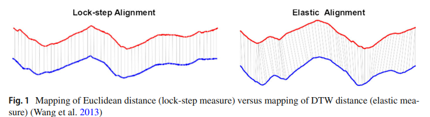

저자: **Amaia Abanda1,2 · Usue Mori2,3 · Jose A. Lozano1,2**

본 포스팅은 논문을 보고 단순하게 정리한 글입니다. Just 참고용으로만 보시길 바래요. 틀린 부분이 있다면 지적은 언제나 환영입니다.

# Abstract

이 Review의 목적은 분류를 위해 시계열 거리를 기반으로 하는 모든 방법의 분류를 제시하는 것이다. 더불어 거리 기반 분류에서 현재 연구 방향에 대한 일반적인 개요를 제공하기 위해 각 접근 방식의 장단점을 논의한다.

# Instruction

시계열 분류 방법은 세 가지 주요 범주로 나눌 수 있다.

- Feature based
  - 시계열이 feature vector로 변환된 다음 신경망이나 의사 결정 트리와 같은 기존 분류기에 의해 분류된다.
  - 특징 추출을 위한 일부 방법에는 주파수 영역의 특징이 고려되는 이산 푸리에 변환(DFT) 또는 이산 웨이블릿 변환(DWT)과 같은 스펙트럼 방법과 특이값 분해(SVD)가 있다. 고유값 분석은 관련 정보를 유지하면서 feature의 set를 줄이기 위해 수행된다.
- Model based
  - 클래스의 모든 시계열이 동일한 기본 모델에 의해 생성된다고 가정하므로 가장 적합한 모델의 클래스로 할당된다.
  - 일부 방식으로는 Auto-regression 또는 hidden Markov을 사용하여 형성하는 경우가 있다.
- Distance based
  - 계열 간의 (비)유사성 측정을 정의한 다음 k-NN(k-nearest neighbor classifier) 또는 SVM(support vector machines)와 같은 거리 기반 분류기에 소개된다.

본 논문은 Distance based에 초점을 맞추어 소개될 것이다.

**시계열 거리 측정을 분류하는 방법** 중 하나를 먼저 소개한다. 아래의 그림은 series 간 i번째 거리를 비교하는 방법과 정렬된 series 간 비선형 매핑을 생성하는 방법을 보여준다.

분류 프로세스 내에서 거리 측정을 활용하는 가장 간단한 방법 중 하나는 k-NN 분류기를 사용하는 것이다. 아울러 그 동안에 복잡한 분류기를 통해 성능의 향상이 이뤄져왔다고 전해진다.

이번 접근은 기존 시계열 거리를 활용해 보다 복잡한 분류기 내에서 이를 활용하는 것을 목표한다. 본 논문에서는 거리 측정을 사용하는 두 가지 새로운 방법을 차별화했다.

1. series의 새로운 특징 표현을 얻기 위해 거리를 사용한다.
2. 커널을 얻기 위해 거리를 사용한다.

이 검토의 목적은 분류를 위해 시계열 거리를 기반으로 하는 모든 방법의 분류를 제시하는 것이다. 동시에 거리 기반 시계열 분류에서 현재 연구 방향에 대한 일반적인 개요를 제공하기 위해 각 접근 방식의 장단점을 논의한다.

